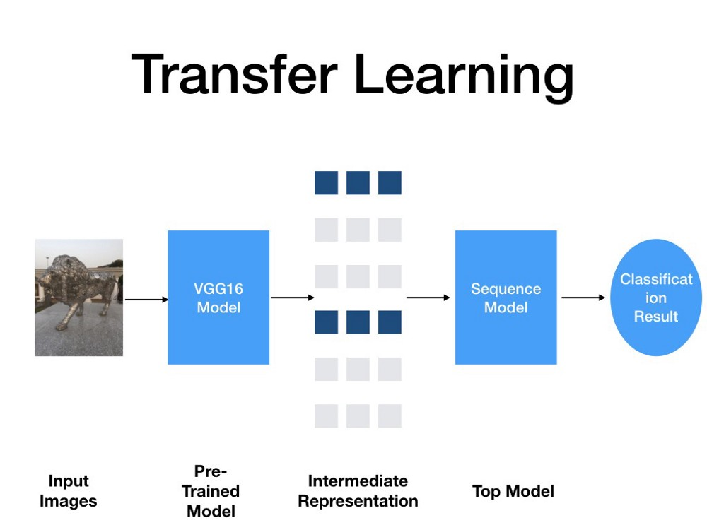

# MLOps-Task04
## Face Recognition using Transfer Learning and fine tuning Model VGG16 Architecture.

## Problem Statement: 
Create a project using transfer learning solving 
various problems like Face Recognition, Image Classification, 
using existing Deep Learning models like VGG16, VGG19, ResNet, etc.

## Solution and Explanation:
https://www.linkedin.com/pulse/mlops-task-04-muhammad-tabish-khanday/

